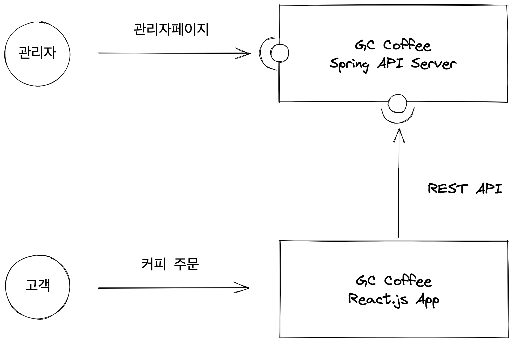

# Grids & Circle Coffee 커피 관리 서비스

## Overview

Coffee Bean Package를 온라인 웹 사이트로 주문을 할 수 있는 커피 주문 관리 서비스 입니다.

## 요구사항

- 매일 전날 오후 2시부터 오늘 오후 2시까지의 주문을 모아서 고객에게 발송한다.

- 별도의 회원 가입을 하지 않고 email을 받으면 주문을 받을 수 있도록 한다.

- 하나의 email로 여러번 주문을 받더라도 하나로 합쳐서 다음날 배송을 보낸다.

- 고객에게 "당일 오후 2시 이후의 주문은 다음날 배송을 시작한다" 라고 알려준다.

## 시스템 구성도

### GC Coffee API Server

개요

- Coffee API 서버를 스프링으로 구성
- 관리자 페이지 제공
- REST API도 제공을하여 Web Application으로 부터 요청을 응답

프로젝트 환경

- Java 17
- Spring Boot
- MySQL
- Thymeleaf

### GC Coffee Client Page

- Coffee Web Application을 React.js로 구성
- 고객이 커피 주문을 받음
- 서버에게 REST API 요청을 함.
